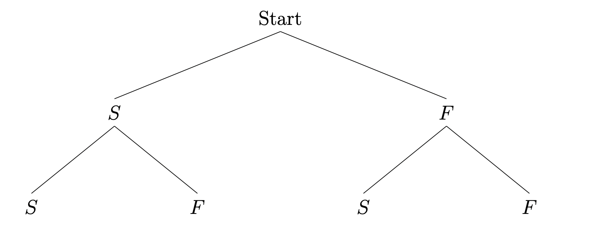

class: inverse, middle

```{r Setup, include = F}
options(htmltools.dir.version = FALSE)
library(pacman)
p_load(broom, latex2exp, ggplot2, ggthemes, ggforce, viridis, dplyr, magrittr, knitr, parallel, xaringanExtra, tidyverse, sjPlot, showtext, mathjaxr, ggforce, furrr, kableExtra, wooldridge, hrbrthemes, scales, ggeasy, patchwork)


# Knitr options
opts_chunk$set(
  comment = "#>",
  fig.align = "center",
  fig.height = 7,
  fig.width = 10.5,
  warning = F,
  message = F,
  dpi=300
)

theme_set(theme_ipsum_rc())

```


# Motivation


---

# Housekeeping

<br><br>


Notes based on `Blitzstein & Hwang (2019)`, ch. 3

  - sections 3.1&#8212;3.3.

---

# The road so far

Let us quickly .hi[recap] what we have seen so far:

--

  - .hi-blue[Descriptive Statistics]: *visual* techniques; *uni* and *bivariate* descriptive methods;
  
--
  
  - .hi-green[Probability Theory]:     
  
    - Probabilities as measures of *uncertainty*; *frequentist* vs. *Bayesian* interpretations;
    - *Joint*, *marginal*, and *conditional* probability;
    - Law of Total Probability (LTP) and Bayes' Theorem.
    
--

<br>

Now, we are still within the ".note[Probability realm]," but we must learn new concepts to study the .hi-orange[behavior] of a .hi[random variable].


---

layout: false
class: inverse, middle

# Random variables

---

# Random variables

> Given an experiment in the sample space $S$, a .hi-blue[random variable] $X$ is a function from $S$ to the real number line $\mathbb{R}$

--

<br>

 
.b[Translation]: a random variable $X$ is a .hi[numerical] outcome of an experiment in the sample space $S$.

--

There are .hi[two] types of RVs:

<br>

  1. .b[Discrete]: the list of possible outcomes of $X$ is *finite* or *countably infinite*.
  
  2. .b[Continuous]:  list of possible outcomes of  $X$ is *uncountably infinite* (such as an interval).

---

layout: false
class: inverse, middle

# Discrete random variables

---

# Discrete random variables

Let us start with an example:

--

Assume we flip a *fair* coin twice.

--

What is the .hi-blue[sample space] for this experiment's .hi-orange[outcomes]?

--

  - $S = \{HH, TH, HT, TT\}$
  
--

<br>

How do we *frame* this situation in the context of random variables?

--

  - Let $X$ be the number of .b[Head] outcomes.
  - How many values can it take on?
  
--

$X$, the number of .b[Heads], can be 0, 1, or 2. 

---

# Discrete random variables


But where does the .hi[random] part come from?

--

 - The randomness comes from the experiment itself!
 
 - An outcome $s \in S$ is chosen according to a .hi-blue[probability function] $P$.
 
 - Before the experiment is performed, we .hi[do not know] the result of the coin flipping, but we can calculate the .hi-blue[probability] associated with each possible value of this random variable!


--

<br>

Thus, what are the probabilities associated with each value for $X$?

--

  - $P(X = 2) = 1/4$;
  - $P(X = 1) = 2/4 = 1/2$;
  - $P(X = 0) = 1/4$;
  
---

layout: false
class: inverse, middle

# Probability distributions

---

# Probability distributions

The .hi[distribution] of a random variable specifies the probabilities of all events associated with it.

--

For a .hi-blue[discrete] RV, its distribution is called a .hi-orange[probability mass function (PMF)].

--

<br>

> A probability mass function *P(X)* describes the plausible values of a discrete RV *X*.

--

<br>

It must satisfy:

  - $0 \leq P(X) \leq 1$;
  - $\sum_{all \ x} P(X) = 1$
  

--

The statement $P(X = x)$ is read as the "probability with which the random variable *X* takes on the numerical value *x*."

---


# Probability distributions

Let us .hi[visually] look at the previous results:

```{r, dev = "svg", echo = FALSE, message = FALSE, warning = FALSE, fig.height=5}
coin_flip %>% 
  count(num_value, sort=TRUE) %>% 
  mutate(pct = n / sum(n)) %>% 
  ggplot(aes(x = num_value, y = pct)) +
  geom_point(size=2) +
  expand_limits(x = c(-1,3),
                y = c(0,1)) +
  labs(y = "PMF",
       x = "x",
       title = "Probability mass function for 2 coin flips") +
  easy_x_axis_title_size(12) +
  easy_y_axis_title_size(12)
```


---


# Probability distributions

Let us .hi[visually] look at the previous results:

```{r, dev = "svg", echo = FALSE, message = FALSE, warning = FALSE, fig.height=5}
coin_flip %>% 
  count(num_value, sort=TRUE) %>% 
  mutate(pct = n / sum(n)) %>% 
  ggplot(aes(x = num_value, y = pct)) +
  geom_point(size=2) +
  geom_segment(aes(x = num_value, xend = num_value, y = 0, yend = pct)) +
  expand_limits(x = c(-1,3),
                y = c(0,1)) +
  labs(y = "PMF",
       x = "x",
       title = "Probability mass function for 2 coin flips") +
  easy_x_axis_title_size(12) +
  easy_y_axis_title_size(12)
```

---

layout: false
class: inverse, middle

# The Binomial distribution


---

# The Binomial distribution

The .hi[simplest] discrete probability distribution to start with is the .hi-slate[Binomial distribution].

--

Suppose an RV that can take on only .hi[two] possible values: 0 and 1.

--


There are .hi-slate[four] properties a binomial experiment must fulfill:

1. It consists of a *fixed* number of *trials* (*n*);

2. Each trial has two possible outcomes: *success* or *failure*;

3. The probability of success is denoted by *p*, while that of failure is *1 − p*;

4. Trials are *independent.* In other words, the outcome of one trial does not affect other outcomes.

--

If properties 2, 3, and 4 are satisfied, we have what is called a .hi-slate[*Bernoulli*] process. By adding the first property, a .hi-slate[binomial] experiment is defined.

---

# The Binomial distribution


A .hi-slate[binomial random variable] is the number of *successes* in the experiment’s *n* trials. 

--

It can take on values 0, 1, 2,..., *n*.

--

  - That is, .b[discrete] values.

<br>
--

If an experiment has *n* trials, we can have *X* successes 

  - *X* is our binomial random variable!
  
  - *X* occurs with probability *p*, and
  
  - *n − X* failures occur with probability *1 − p*.


---

# The Binomial distribution

Using a *probability tree* to illustrate a binomial experiment (with *n = 2* trials):

.center[



]

--

For .hi[any] number of trials, to count the number of branch sequences that produce *x* successes and *n − x* failures, we use:

$$
\begin{aligned}
C_x^n = \dfrac{n!}{x!(n-x)!}
\end{aligned}
$$
---

# The Binomial distribution

In addition to this *counting* relation, the *probability* for each sequence of branches that represent *x* successes and *n − x* failures is represented by:

$$
\begin{aligned}
p^x(1-p)^{n-x}
\end{aligned}
$$

<br>

--

Combining these .hi[two] components, we have the .hi-slate[probability function] for a Binomial distribution:

<br>

$$
\begin{aligned}
P(X = x) = \dfrac{n!}{x!(n-x)!}p^x(1-p)^{n-x} \ , \ \text{for} \  x=0,1,2,3,...,n
\end{aligned}
$$

---

# The Binomial distribution

An example:

<br>

A quiz consists of .b[10] multiple choice questions. Each question has 5 possible answers, only one being correct. A student plans to .hi[*guess*] the answer to each question.

--

Calculate the probability of 

  - *(a)* no correct answers, and 
  - *(b)* of two correct answers.


---

layout: false
class: inverse, middle

# Cumulative probabilities


---

# Cumulative probabilities

In case we wish to find the probability that a random variable is .hi[less than or equal to] a value, we are looking for a .hi-blue[cumulative probability function].

--

  - Such a probability is denoted by *P(X &#8804; x)*.
  
--

<br>

Using the previous problem, find the probability that the student .hi[fails] the quiz. 

  - Failure occurs when the mark is below 50%.
  

---

# The binomial distribution

We can also calculate descriptive measures of .hi-slate[central location] and .hi-orange[variability] for specific distributions.

--

<br>

In the case of a .hi-slate[binomial distribution], its mean, variance, and standard deviation measures are:

  - .b[Mean]: $\mu = np$
  
  - .b[Variance]: $\sigma^2 = np(1-p)$
  
  - .b[Standard deviation]: $\sigma = \sqrt{np(1-p)}$

--

As an example, assume that the entire class from the previous example is as prepared as the aforementioned student for the quiz. That is, *everyone* plans to *guess* all answers.

  - What will be the average mark?
  - What will be the standard deviation?

---

layout: false
class: inverse, middle

# The Poisson distribution


---

# The Poisson distribution

The *Poisson* distribution is .hi[similar] to the Binomial.

--

A Poisson RV is the number of occurrences of .hi-slate[success] events in an *interval of time* or *specific region of space*.

--

<br>

Some examples of Poisson random variables:

  - number of cars arriving at a specific service station in a 1-hour interval;
  
  - number of flaws within a certain portion of a product’s assembly line;
  
  - number of accidents registered in one day on a particular stretch of highway.
  


---

# The Poisson distribution

<br><br>

The Poisson distribution also has .hi-slate[four properties] a discrete random variable must fulfill to be considered a Poisson RV:

1. The number of successes (# successes) in any interval is independent of the number of successes in any other interval;

2. The probability of success, *P(success)*, in an interval is the same for all equally-sized intervals;

3. *P(success)* in an interval is proportional to the size of the interval;

4. The probability of more than one success in an interval approaches zero as the interval becomes smaller.

---

# The Poisson distribution

The probability with which a Poisson random variable assumes the value of *x* successes in an interval is given by:


$$
\begin{aligned}
P(X = x) = \dfrac{e^{-\lambda}\lambda^x}{x!} \ , \ \text{for} \ x=1,2,3,...
\end{aligned}
$$

<br>

- where $\lambda$ is the average occurrence of *successes* for our Poisson random variable; 

- $e$ is the base of the natural logarithm (approximately 2.71828...)

- *x* is the number of successes we are interested in.

--

Finally, the .hi[mean] and .hi[variance] of a Poisson random variable because they are the same for the Poisson distribution.

  - Therefore, $\lambda = \sigma^2$.

---

# The Poisson distribution

<br><br>

A quick example:

--

<br>

Assume that the number of *typos* in a textbook is Poisson distributed, with an average of 1.5 typos per 100 pages. 

  - What is the probability of *no typos* if we randomly select 100 pages of this textbook?


---

layout: false
class: inverse, middle

# Next time: Continuous random variables


---
exclude: true