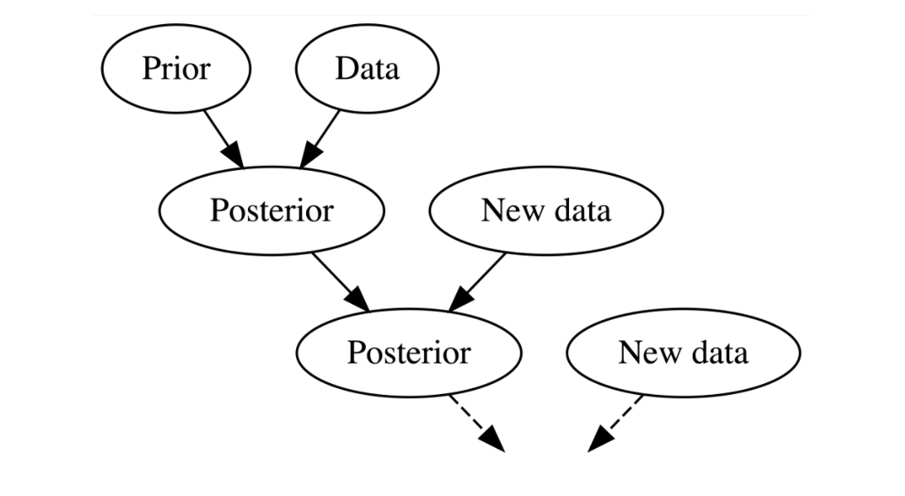

class: inverse, middle

```{r Setup, include = F}
options(htmltools.dir.version = FALSE)
library(pacman)
p_load(broom, latex2exp, ggplot2, ggthemes, ggforce, viridis, dplyr, magrittr, knitr, parallel, xaringanExtra, tidyverse, sjPlot, showtext, mathjaxr, ggforce, furrr, kableExtra, wooldridge, hrbrthemes, scales, ggeasy, patchwork)


# Knitr options
opts_chunk$set(
  comment = "#>",
  fig.align = "center",
  fig.height = 7,
  fig.width = 10.5,
  warning = F,
  message = F,
  dpi=300
)

theme_set(theme_ipsum_rc())

```


# Motivation


---

# Housekeeping

<br><br>


Notes based on `Johnson et al. (2022)`:

  - Chapters 1 and 2
  
  - Available [`here`](https://www.bayesrulesbook.com/)


---

# The road so far

<br><br>

After studying *descriptive statistics* and *probability theory*, it is time .hi-blue[combine] these two areas and produce .hi[informed conclusions] about a problem of interest.

--

This is the process of .hi-blue[statistical inference].

--

Over the next few weeks, we will approach this topic from .hi[both] *Bayesian* and  *classical* (*frequentist*) perspectives.

--

We start with the .red[*Bayesian*].


---

layout: false
class: inverse, middle


# The Bayesian process

---

# The Bayesian process

<br><br>

Regardless of the approach one adopts for inference, the main interest is to .hi[learn from data].

--

This process allows one to make *predictions*, evaluate *hypotheses*, fit statistical *models*, and so on.

--

Both approaches will also draw conclusions based on .hi[sample data].

--

The key distinction lies in the .hi-slate[logic] and .hi-slate[interpretations] derived from each point of view.


---

# The Bayesian process

<br><br>

While for a frequentist a probability means a .red[*long-run relative frequency*] of a repeatable event, a Bayesian defines it as a .red[*measure of relative plausibility*] of an event.

--

Moreover, a frequentist assumes that the data .hi-blue[alone] drives any further information.

--

A Bayesian, on the other hand, uses data .hi[along] with incoming (*prior*) information.

--

This way, while a Bayesian asks: "*in light of these data, what is the plausibility of my hypothesis being correct?*"; a frequentist asks: "*in case my hypothesis is not correct, what are the odds of having observed such data?*"

---

# The Bayesian process

As we accumulate life experiences (i.e., incorporate new information), we .hi-blue[update] our knowledge about our interests and surroundings.

--

Thus, it is almost impossible not to use some .hi[previous background] (prior information) when trying to answer a question.

--

Whether one's previous knowledge will be *overwhelmed* by reality or not is at the crux of the Bayesian inferential process. 

--


.center[


]

---

# The Bayesian process

Before we move on, let us recall some .hi-orange[key] probability concepts that we will use in a  moment.

--

<br>

  - .b[Marginal probability]: an .red[*unconditional*] probability, describing the behavior of a single variable.
  
    - *P(A)*
  
  - .b[Joint probability]: a statement about the .red[*simultaneous*] behavior of two (or more) variables.
  
    - *P(A and B)*
    
  - .b[Conditional probability]: describes how one event is .red[dependent ]upon another event.
  
    - *P(A | B)*

---

# The Bayesian process

Now, recall the .hi[mathematical definition] of a conditional probability:

$$
\begin{aligned}
P(A|B) = \dfrac{P(A \cap B)}{P(B)}
\end{aligned}
$$

--

<br>

And since *P(A &#8745; B) = P(B &#8745; A)*, we can rewrite the above as

$$
\begin{aligned}
P(A|B) = \dfrac{P(A) \ P(B | A)}{P(B)}
\end{aligned}
$$

<br>

... which is .hi-green[Bayes' theorem].

---

# The Bayesian process

Now, we can replace events .red[*A*] and .red[*B*] with other elements. The usual notation is as follows:

--

<br>

$$
\begin{aligned}
P(\theta|y) = \dfrac{P(\theta) \ P(y | \theta)}{P(y)}
\end{aligned}
$$
--

<br>

where *&#952;* may be a population .red[*parameter*], a specific .red[*hypothesis*], or whatever the researcher's .red[*interest*] may be.

--

And *y* is the available .red[*data*/*information*] they have.

--

*P(&#952; | y)* is known as a .hi-slate[posterior distribution].

---

# The Bayesian process

Each element in Bayes' theorem has a special *name* and *function.*

--

<br>

- $P(\theta)$ is the .hi-blue[prior] belief/information we incorporate into our analysis. 

  - Notice that it is a .red[*marginal probability*], thus reflecting what we know about the subject .hi[before seeing any data].
  
--

- $P(y | \theta)$ is the .hi-blue[likelihood] function.

  - It describes the ways in which we can observe the data (*y*), .hi[*given that our hypothesis*] (*&#952;*) .hi[*is true*]. It quantifies the extent to which the evidence supports our proposition.
  
--

- $P(y)$ is the .hi-blue[marginal likelihood] (*aka* .red[*denominator*], .red[*normalizing constant*], .red[*probability of the data*]).

  - It can be interpreted as the probability of observing the data .hi[under *all* possible scenarios].


---

# The Bayesian process

Since the denominator in Bayes' theorem is simply a *normalizing constant*, we can .hi-blue[rewrite] it as

<br>

$$
\begin{aligned}
P(\theta|y) \propto P(\theta) \ P(y | \theta)
\end{aligned}
$$

--

<br>

where the $\propto$ symbol means ".red[proportional to]."

--

In other words, the normalizing constant's function is to *ensure* that the posterior is a .red[*proper probability distribution*].

  - i.e., sums/integrates to 1.


--

This is especially .red[*convenient*] since, for complex situations, properly calculating the denominator may be *computationally expensive*.

---

layout: false
class: inverse, middle

# Bayes' theorem in practice

---


# Bayes' theorem in practice


Suppose we are interested in the underlying .red[*proportion*] of Bayesians *vs.* frequentists in the Social Science fields.

--

We then gather some data from surveys, asking people whether they would define themselves as *frequentists* or *Bayesians.*

--

In terms of Bayes' theorem, we have


$$
\begin{aligned}
P(\theta|y) = \dfrac{P(\theta) \ P(y | \theta)}{P(y)}
\end{aligned}
$$

<br>

where *&#952;* is the entire population proportion of Bayesians (*B*) to frequentists (*F*), and *y* is the data from the survey.

---


# Bayes' theorem in practice

Let us understand this setting .hi[logical] and .hi-blue[graphically].

--

Assume we interview **4** people, and you do not know how many are *B* and how many are *F*.

--

What are the .hi-blue[possible outcomes] from this experiment?

--

After we know the ways in which we can observe the outcomes, how do we use this information for .hi[inference] about the proportion of interest?

---

# Bayes' theorem in practice

For simplicity, let us assume that, before seeing any data, any proportion is .hi-blue[equally likely].

--

What does this imply?

--


.center[

$$
\begin{aligned}
\theta \sim \text{Unif}(0, 1) 
\end{aligned}
$$
]


--

```{r, echo=FALSE, dev = "svg", fig.height=4, fig.width=10}

data <- 
  tibble(
    p_grid = seq( from=0 , to=1 , length.out=1000 ),
    prior = rep( 1 , 1000 ),
    likelihood = dbinom( 1 , size=1 , prob=p_grid ),
    likelihood2 = dbinom( 1 , size=2 , prob=p_grid ),
    likelihood3 = dbinom( 2 , size=3 , prob=p_grid ),
    likelihood4 = dbinom( 3 , size=4 , prob=p_grid ),
    likelihood5 = dbinom( 3 , size=5 , prob=p_grid ),
    likelihood6 = dbinom( 3 , size=6 , prob=p_grid ),
    likelihood7 = dbinom( 3 , size=7 , prob=p_grid ),
    likelihood8 = dbinom( 3 , size=8 , prob=p_grid ),
    unstd_posterior = likelihood * prior,
    unstd_posterior2 = likelihood2 * prior,
    unstd_posterior3 = likelihood3 * prior,
    unstd_posterior4 = likelihood4 * prior,
    unstd_posterior5 = likelihood5 * prior,
    unstd_posterior6 = likelihood6 * prior,
    unstd_posterior7 = likelihood7 * prior,
    unstd_posterior8 = likelihood8 * prior,
    norm_posterior = unstd_posterior/sum(unstd_posterior)
  )


data %>% 
  ggplot(aes(x = p_grid, y = prior)) +
  geom_line(size = 1, linetype = 1) +
  labs(y = "Plausibility",
       x = "Proportion of Bayesians") +
  easy_x_axis_title_size(13) +
  easy_y_axis_title_size(13)
```

---

# Bayes' theorem in practice

How do we define $P(y | \theta)$?

--

The survey follows a .hi-blue[binomial experiment].

--


Now, assume we ask the first person, and she answers "Bayesian."

--

```{r, echo=FALSE, dev = "svg", fig.height=4, fig.width=10}


data %>% 
  ggplot(aes(x = p_grid, y = likelihood)) +
  geom_line(size = 1, linetype = 1) +
  labs(y = "Plausibility",
       x = "Proportion of Bayesians") +
  easy_x_axis_title_size(13) +
  easy_y_axis_title_size(13)
```

---

# Bayes' theorem in practice

Combining prior and likelihood...

```{r, echo=FALSE, dev = "svg", fig.height=6, fig.width=16}


p1 <- data %>% 
  ggplot(aes(x = p_grid, y = prior)) +
  geom_line(size = 1, linetype = 2) +
  labs(y = "Plausibility",
       x = "Proportion of Bayesians",
       title = "Prior") +
  easy_x_axis_title_size(13) +
  easy_y_axis_title_size(13) 

p2 <- data %>% 
  ggplot(aes(x = p_grid, y = likelihood)) +
  geom_line(size = 1, linetype = 2) +
  labs(y = "Plausibility",
       x = "Proportion of Bayesians",
       title = "Likelihood") +
  easy_x_axis_title_size(13) +
  easy_y_axis_title_size(13)

p3 <- data %>% 
  ggplot(aes(x = p_grid, y = unstd_posterior)) +
  geom_line(size = 1, linetype = 1) +
  labs(y = "Plausibility",
       x = "Proportion of Bayesians",
       title = "Posterior") +
  easy_x_axis_title_size(13) +
  easy_y_axis_title_size(13)

p1 | p2 | p3
```

---

# Bayes' theorem in practice


Now, we ask a second person. She answers "Frequentist."

--

```{r, echo=FALSE, dev = "svg", fig.height=5, fig.width=8}
data %>% 
  ggplot(aes(x = p_grid, y = unstd_posterior2)) +
  geom_line(size = 1) +
  geom_line(aes(x = p_grid, y = likelihood), linetype = 2) +
  labs(y = "Plausibility",
       x = "Proportion of Bayesians") +
  easy_x_axis_title_size(13) +
  easy_y_axis_title_size(13)
```

---

# Bayes' theorem in practice

And off we go...

```{r, echo=FALSE, dev = "svg", fig.height=7, fig.width=15}


p4 <- data %>% 
  ggplot(aes(x = p_grid, y = unstd_posterior3)) +
  geom_line(size = 1) +
  geom_line(aes(x = p_grid, y = likelihood2), linetype = 2) +
  labs(y = "Plausibility",
       x = "Proportion of Bayesians") +
  easy_x_axis_title_size(13) +
  easy_y_axis_title_size(13)

p5 <- data %>% 
  ggplot(aes(x = p_grid, y = unstd_posterior4)) +
  geom_line(size = 1) +
  geom_line(aes(x = p_grid, y = likelihood3), linetype = 2) +
  labs(y = "Plausibility",
       x = "Proportion of Bayesians") +
  easy_x_axis_title_size(13) +
  easy_y_axis_title_size(13)

p6 <- data %>% 
  ggplot(aes(x = p_grid, y = unstd_posterior5)) +
  geom_line(size = 1) +
  geom_line(aes(x = p_grid, y = likelihood4), linetype = 2) +
  labs(y = "Plausibility",
       x = "Proportion of Bayesians") +
  easy_x_axis_title_size(13) +
  easy_y_axis_title_size(13)

p7 <- data %>% 
  ggplot(aes(x = p_grid, y = unstd_posterior6)) +
  geom_line(size = 1) +
  geom_line(aes(x = p_grid, y = likelihood5), linetype = 2) +
  labs(y = "Plausibility",
       x = "Proportion of Bayesians") +
  easy_x_axis_title_size(13) +
  easy_y_axis_title_size(13)


p8 <- data %>% 
  ggplot(aes(x = p_grid, y = unstd_posterior7)) +
  geom_line(size = 1) +
  geom_line(aes(x = p_grid, y = likelihood6), linetype = 2) +
  labs(y = "Plausibility",
       x = "Proportion of Bayesians") +
  easy_x_axis_title_size(13) +
  easy_y_axis_title_size(13)

p9 <- data %>% 
  ggplot(aes(x = p_grid, y = unstd_posterior8)) +
  geom_line(size = 1) +
  geom_line(aes(x = p_grid, y = likelihood7), linetype = 2) +
  labs(y = "Plausibility",
       x = "Proportion of Bayesians") +
  easy_x_axis_title_size(13) +
  easy_y_axis_title_size(13)

(p4 | p5 | p6) / (p7 | p8 | p9)


```

---

# Bayes' theorem in practice

<br><br><br>

What Bayes's theorem (and Bayesian inference) does is .hi-blue[updating] previous plausibilities in light of new data, producing a *new set* of plausibilities (the posterior distribution).


---


layout: false
class: inverse, middle

# Next time: More examples!


---
exclude: true