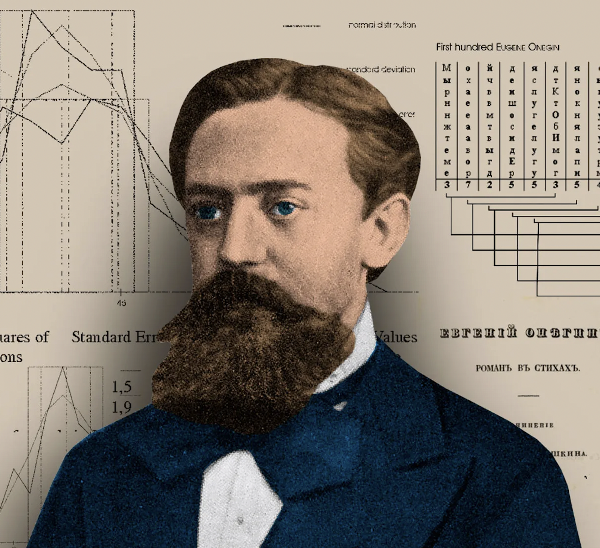
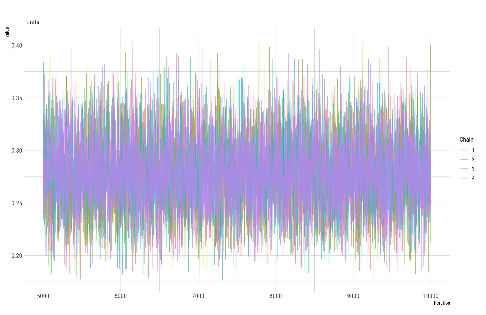
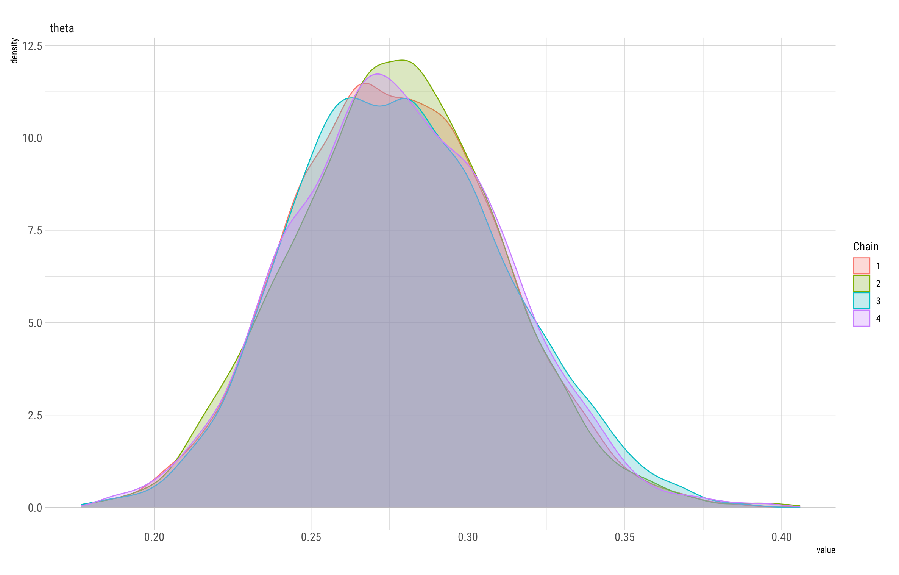

class: inverse, middle

```{r Setup, include = F}
options(htmltools.dir.version = FALSE)
library(pacman)
p_load(broom, latex2exp, ggplot2, ggthemes, ggforce, viridis, dplyr, magrittr, knitr, parallel, xaringanExtra, tidyverse, sjPlot, showtext, mathjaxr, ggforce, furrr, kableExtra, wooldridge, hrbrthemes, scales, ggeasy, patchwork)


# Knitr options
opts_chunk$set(
  comment = "#>",
  fig.align = "center",
  fig.height = 7,
  fig.width = 10.5,
  warning = F,
  message = F,
  dpi=300
)

theme_set(theme_ipsum_rc())

```


# Motivation


---

# Housekeeping

<br><br>


Notes based on `Johnson et al. (2022)`:

  - Chapter 6
  
  - Available [`here`](https://www.bayesrulesbook.com/)
  
<br>
  

Also, make sure to install the `rstan` package by following the directions in the book's `Preface`, *Getting set up* section.


---

# Motivation

<br>

> *"When we can't know something, we approximate it."*

--

<br><br>

This is the motivation for today's lecture.

--

By this point, you have probably noticed that, in order to answer more .hi[complex/flexible] questions, the .hi-blue[complexity] of statistical models grows in a rather absurd way.

--

However, the mathematical complexity does not change anything about the .hi-blue[logic of the process].

---

class: clear

.center[

]


---

# Motivation

Recall the .hi[proportion] (*&theta;*) of Bayesian researchers within the Social Sciences we were interested in a few lectures ago.

--

What if we are curious about the *same* proportion, but for *other* areas as well?

  - e.g., Natural Sciences, Hard Sciences, etc.
  
--

With a quite simple question in mind, our problem goes from

$$
\begin{aligned}
P(\theta \ | \ y) = \dfrac{P(\theta) \ P(y \ | \ \theta)}{\int_{\theta}P(\theta) \ P(y \ | \ \theta) \ d\theta}
\end{aligned}
$$
--

to

$$
\begin{aligned}
P(\vec{\theta} \ | \ y) = \dfrac{P(\theta) \ P(y \ | \ \theta)}{\int_{\theta_1} \int_{\theta_2} \int_{\theta_3} \int_{\theta_4} \int_{\theta_5} ... \int_{\theta_k}P(\theta) \ P(y \ | \ \theta) \ d\theta_k ... d\theta_2 d\theta_1}
\end{aligned}
$$

---

# Motivation

Even today's computers will .b[not] be able to properly calculate such posteriors.

--

But the .hi-orange[good news] is that we can approximate the posterior .hi-blue[via simulation].

--

<br>

Here, we will explore two simulation techniques:

  1. .red[*Grid approximation*];
  
  2. .red[*Markov Chain Monte Carlo (MCMC)*].


--

<br>

When properly motivated, these techniques provide a .hi[sample] of *&theta;* values whose properties reflect those of the "true" posterior distribution.


---


layout: false
class: inverse, middle

# Grid approximation


---

# Grid approximation

<br><br>

.center[

]

---

# Grid approximation

Our "target image" is the posterior distribution.

--

if we are able to evaluate its PDF at a .hi[discrete] and .hi[finite] grid of possible *&theta;* values, we may get a *nice image* of what we are looking for.

--

<br>

The .hi-blue[recipe] `r emo::ji("woman_cook")` `r emo::ji("man_cook")`:

.pseudocode-small[

1. Define a discrete grid of possible *&theta;* values;

2. Evaluate the **prior** and **likelihood** at each *&theta;* grid value;

3. Multiply the prior by the likelihood;

4. Normalize the product to get a posterior distribution that adds up/integrates to 1.


]


---

# Grid approximation

In practice:

<br>

```{r}
data_grid <- tibble(
  
  theta_grid = seq(from = 0, to = 1, by = 0.01),
  
  prior = dbeta(theta_grid, shape1 = 20, shape2 = 60),
  
  likelihood = dbinom(x = 30, size = 100, prob = theta_grid)
  
)
```


---

# Grid approximation

In practice:

<br>

```{r}
data_grid <- data_grid %>% 
  
  mutate(unstd_posterior = prior * likelihood,
         
         std_posterior = unstd_posterior/sum(unstd_posterior))
```

---

# Grid approximation

In practice:

<br>

```{r}
data_grid %>% 
  summarize(sum_posterior = sum(std_posterior))

```

---

# Grid approximation

```{r, dev = "svg", fig.height = 4.5, fig.width=8}
data_grid %>% 
  ggplot(aes(x = theta_grid, y = std_posterior)) +
  geom_line(size = .8) 

```

---

# Grid approximation

<br><br><br>

Check out section `6.1.2` of the `Bayes Rules!` book for a .hi[Gamma-Poisson] example of grid approximation.


---

# Grid approximation

<br>


Grid approximation is simple.

--

.hi-orange[However]...


--

As we try to increase the  .red[*number of parameters*] we are curious about, grid approximation is not very effective.

--

<br>

It suffers from the ".hi-blue[curse of dimensionality]."

---


layout: false
class: inverse, middle

# Markov Chain Monte Carlo


---

# Markov Chain Monte Carlo

Given the limitations of grid approximation, .hi-blue[Markov Chain Monte Carlo] (MCMC) methods are the .hi[most efficient and used] techniques to properly .red[*approximate a posterior distribution*], even when it is too complicated to go over the Math.

--

The idea is .red[*very simple*].

<br>

--

As a first step, we want to simulate a sample of *&theta;* values:

$\{\theta^1, \theta^2, \theta^3, ..., \theta^N\}$ 

--

And then, as a second step, use this sample to *approximate* the .hi-green[main features] of the posterior distribution.

---

# Markov Chain Monte Carlo

One way to start is through .hi-blue[Monte Carlo] simulations.

--

Monte Carlo simulations produce  .hi[random samples] of size *N*, where each value is *independent* of one another.

--

As a quick example, suppose we are interested in the how many cars pass by the *roundabout* close to the Stadium here at the U from 4:00 to 5:00 pm.

--

This is a .hi-blue[count] random variable case, which can be analyzed through a .hi-slate[Gamma-Poisson] model.

---

# Markov Chain Monte Carlo

Suppose we have a prior belief that, on average, 250 cars pass by there within this hour, but we may allow for some uncertainty.

--

And we stop by the roundabout today at this time slot and collect some new data.

--

Here's a simulation:

```{r}
set.seed(123)

dd <- tibble(
  
  lambda_par = rgamma(10000, shape = 500, rate = 2),
  y = rpois(10000, lambda = lambda_par)
  
  
)
```


---

# Markov Chain Monte Carlo


```{r}

# How many values from this simulation are equal to 250?

dd %>% 
  filter(y == 250) %>% 
  nrow()

dd %>% 
  filter(y == 250) %>% 
  head(4)
```

---

# Markov Chain Monte Carlo


```{r, dev = "svg", fig.height = 4.5, fig.width=8}
dd %>% 
  filter(y == 250) %>% 
  ggplot(aes(x = lambda_par)) +
  geom_density()
```


---
class: clear

# Markov Chain Monte Carlo

```{r, dev = "svg", fig.height = 5, fig.width=8}
dd %>% 
  filter(y == 250) %>% 
  ggplot(aes(x = lambda_par)) +
  geom_density() +
  stat_function(fun = dgamma, args = list(shape = 750, rate = 3), color = "red")
```


---

# Markov Chain Monte Carlo

We can check the validity of a Monte Carlo simulation if we .hi-blue[know] the posterior's form.

--


But how can we check our sanity if we .hi[don't know] its form?

--

We introduce .hi-green[Markov chains].

--

.hi-slate[MCMC] follows the same principle as Monte Carlo simulation, but each value $\theta^{1+i}$ in the chain $\{\theta^1, \theta^2, \theta^3, ..., \theta^N\}$ .hi-slate[depends on] the previous value $\theta^{i}$, but is .hi-red[independent] of all other past values.

--

The chains visit various spots of the *sample space*, so we come up with a *nice picture* of the posterior distribution.

---

# Markov Chain Monte Carlo

.center[

]

---

# Markov Chain Monte Carlo

.center[

]

---

# Markov Chain Monte Carlo

.center[

]


[`Stan official website`](https://mc-stan.org/)

--

We will use the [`rstan`](https://cran.r-project.org/web/packages/rstan/vignettes/rstan.html) $\textsf{R}$ package to approximate teh posterior via MCMC.


In order to properly use this package, go back to the first slide and follow the directions to set it up.


---

layout: false
class: inverse, middle

# MCMC in practice


---

# MCMC in practice

<br><br><br>

The two main steps for approximating the posterior with MCMC methods using `rstan` are:

  1. .hi-blue[Defining] the model's structure;
  
  2. .hi-blue[Simulating] the posterior.
  
---

# MCMC in practice

Defining the posterior:


```{r}
your_model <- "

  data {
    
  }
  
  parameters {
    
  }
  
  model {
    
  }
  
"
```

--

<br>

Check out the `rstan-model-starter.R` file on Canvas!

---


# MCMC in practice

We always start with the `model` portion:


```{r}
your_model <- "

  data {
    
  }
  
  parameters {
    
  }
  
  model {
  
    Y ~ binomial(100, theta);  // the likelihood
    
    theta ~ beta(20, 60);     // the prior
  
  
    
  }
  
"
```


---


# MCMC in practice

We then move on to .hi-blue[defining the parameters] we have included in the `model` section.

```{r}
your_model <- "

  data {
    
  }
  
  parameters {
  
  real<lower=0, upper=1> theta;  // our parameter of interest is theta
    
  }
  
  model {
  
    Y ~ binomial(100, theta);  // the likelihood
    
    theta ~ beta(20, 60);     // the prior
  
  
    
  }
  
"
```


---

class:clear


Now, we deal with the remaining .hi[data] and .hi-blue[hyperparameters] in the `data` section.

```{r}
your_model <- "

  data {
  
    int<lower=1> n;               // the number of trials
    int<lower=0, upper=n> Y;    // the number of sucesses
    real<lower=0> alpha;       // the beta prior's alpha hyperparameter
    real<lower=0> beta;       // the beta prior's beta hyperparameter
  }
  
  parameters {
  
    real<lower=0, upper=1> theta;  // our parameter of interest is theta
    
  }
  
  model {
  
    Y ~ binomial(100, theta);  // the likelihood
    
    theta ~ beta(20, 60);     // the prior
  
  }
  
"
```


---


# MCMC in practice

Defining the model is the .hi[hardest] part.

--

After this gets done, `rstan` does the heavy lifting for us.

```{r, eval = FALSE, message = FALSE}

library(rstan)
options(mc.cores = parallel::detectCores())  ## using your computer cores.


# Simulating the posterior:

set.seed(123)    ## don't forget to set a seed!

model_sim <- stan(
  
  model_code = your_model,    ## the model from before
  
  data = list(alpha = 20, beta = 60, Y = 30, n = 100),  ## the actual data and hyperparameters
  
  chains = 4, iter = 5000 * 2     ## run 4 parallel Markov chains, with 10,000 simulations
  
)
```


---

# MCMC in practice


.center[

]

---

# MCMC in practice


.center[

]


---

layout: false
class: inverse, middle

# Next time: Posterior inference


---
exclude: true