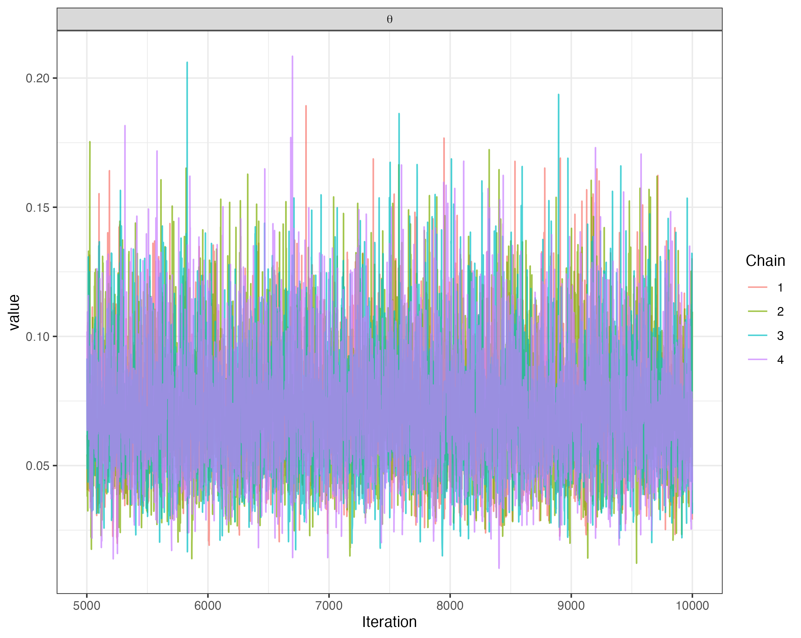
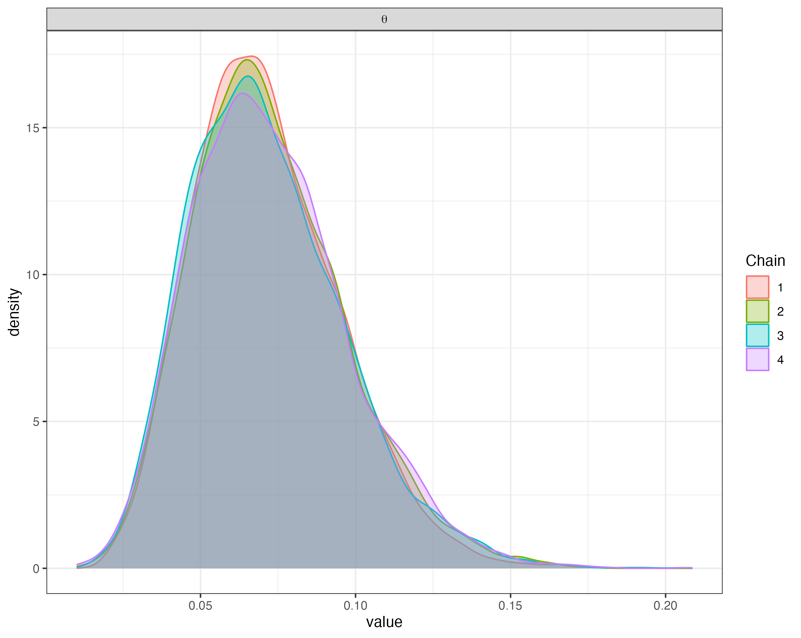
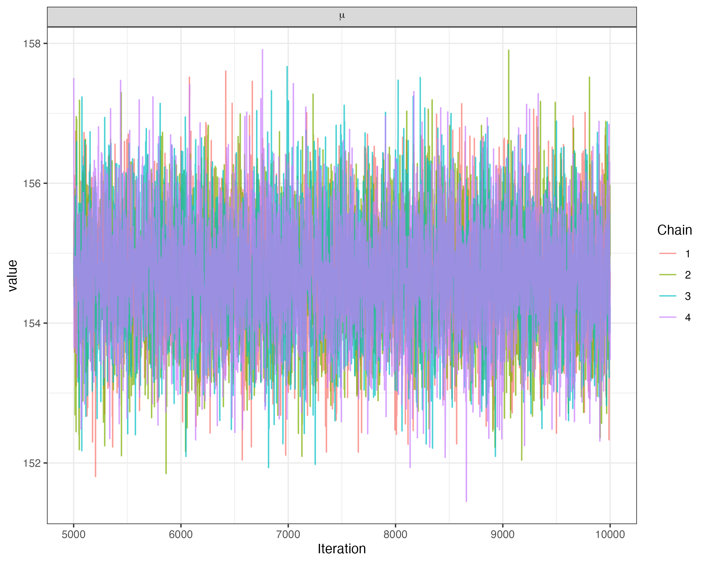
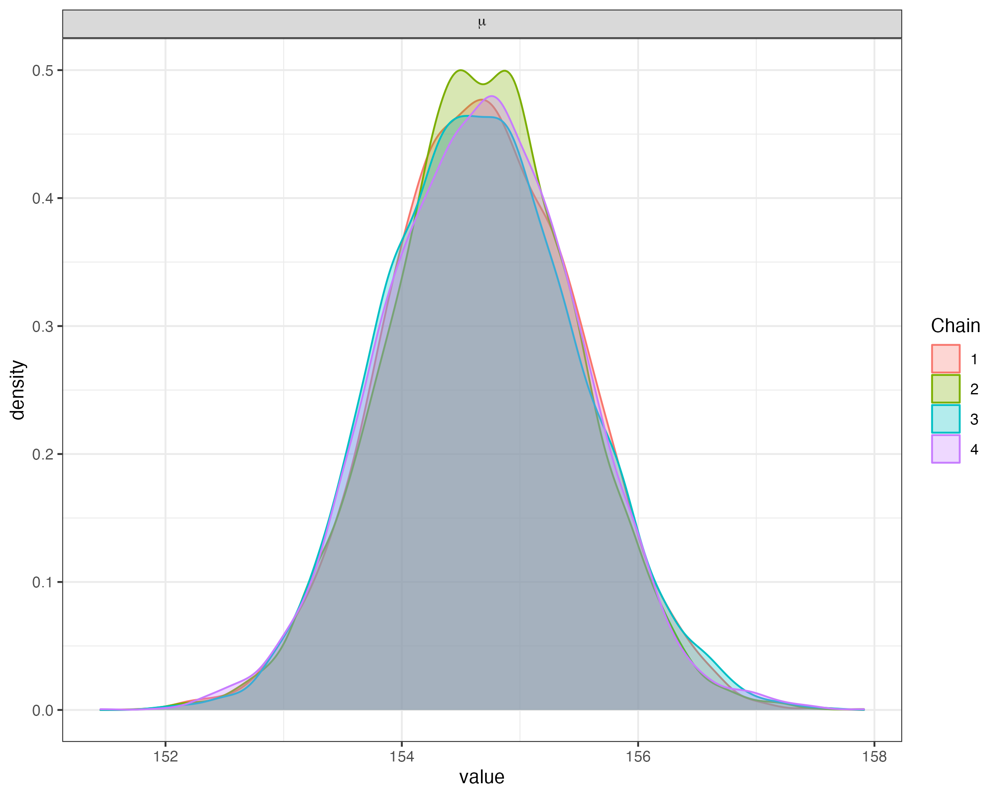
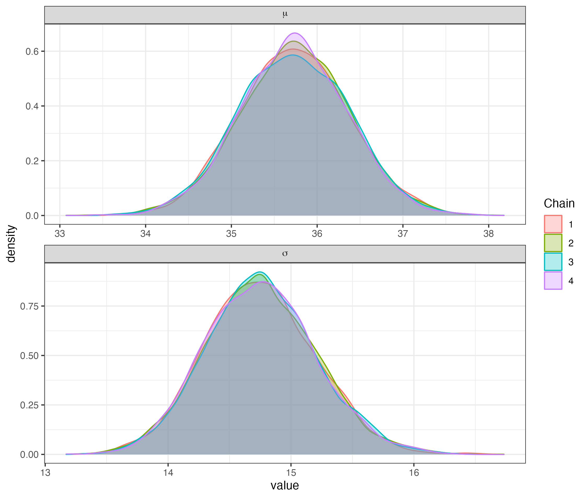

layout: true
class: clear
---

## Problem 1


```{r, message = FALSE, warning = FALSE, echo = FALSE}
library(tidyverse)
library(hrbrthemes)

theme_set(theme_ipsum_rc())

```


<br>

(a) Simulate 1,000 values drawn from a .b[Poisson]-distributed random variable, with rate parameter 16. Do not forget to set a .b[seed] for reproducibility.

.hi[ANSWER]:

```{r, eval = FALSE}
set.seed(123)
x_a <- rpois(n = 1000, lambda = 16)

```


(b) Generate 10,000 values drawn from a .b[Beta]-distributed random variable, with shape parameters 10 and 15. Do not forget to set a .b[seed] for reproducibility.

.hi[ANSWER]:

```{r, eval = FALSE}
set.seed(123)
x_b <- rbeta(n = 10000, shape1 = 10, shape2 = 15)

```

(c) Generate 1,000 values drawn from a .b[uniformly]-distributed random variable, ranging from 0 to 20. Do not forget to set a .b[seed] for reproducibility.

.hi[ANSWER]:

See part (d).


---
class: clear

(d) Repeat part (c), now simulating 10,000 values. Produce a histogram for both parts, and compare your results.

.hi[ANSWER]:

```{r, dev = "svg", message = FALSE, fig.height = 3}

set.seed(123)
x_c <- runif(n = 1000, min = 0, max = 20)

x_c %>% 
  as_tibble() %>% 
  ggplot(aes(x = value)) +
  geom_histogram(color = "white", alpha = 0.7, fill = "pink") +
  labs(title = "n = 10,000 draws") +
  labs(title = "n = 1,000 draws")


# Notice the difference on the vertical axis!

set.seed(123)
x_d <- runif(n = 10000, min = 0, max = 20)

x_d %>% 
  as_tibble() %>% 
  ggplot(aes(x = value)) +
  geom_histogram(color = "white", alpha = 0.7) +
  labs(title = "n = 10,000 draws")

```

---
class:clear

(e) Generate 5,000 draws from a Normal distribution, with mean 5 and standard deviation 2. Generate these simulated data's density curve, and put, on the same plot, its long-run probability density function (PDF) curve. Compare your results. Do not forget to set a .b[seed] for reproducibility.


.hi[ANSWER]:

```{r, dev = "svg", message = FALSE, fig.height = 3}
set.seed(123)
x_e <- rnorm(n = 5000, mean = 5, sd = 2)


x_e %>% 
  as_tibble() %>% 
  ggplot(aes(x = value)) +
  geom_density() +
  stat_function(fun = dnorm, args = list(mean = 5, sd = 2), 
                size = 1.2, alpha = 0.8, color = "#8b9dc3") +
  stat_function(fun = dnorm, args = list(mean = 5, sd = 2), 
                geom = "area", fill = "#8b9dc3", alpha = 0.35) 
  
```

---
class:clear


## Problem 2

<br>


Consider the following model:

$$
\begin{aligned}
Y|\theta  \sim \text{Binomial}(n, \theta) \\
\theta  \sim \text{Beta}(3,8)
\end{aligned}
$$
Approximate the posterior distribution, $\theta|Y$, using .b[grid approximation]. How "thin" the grid will be is up to you, but make sure to play around with different values. 

Lastly, assume that you observe $n = 100$ trials, with $Y=5$ successes.

.hi[ANSWER]:

```{r}
# Setting up the grid, prior, and likelihood:

data_grid <- tibble(
  
  theta_grid = seq(from = 0, to = 1, by = 0.01),
  
  prior = dbeta(theta_grid, shape1 = 3, shape2 = 8),
  
  likelihood = dbinom(x = 5, size = 100, prob = theta_grid)
)
```

```{r}
# Calculating the unstandardized and standardized posteriors:

data_grid <- data_grid %>% 
  mutate(unstd_posterior = prior * likelihood,
         std_posterior = unstd_posterior/sum(unstd_posterior))
```


```{r, dev = "svg", message = FALSE, fig.height = 3}
# Plotting the posterior:

data_grid %>% 
  ggplot(aes(x = theta_grid, y = std_posterior)) +
  geom_line(size = .8)

```


---
class:clear

## Problem 3

<br>

Use .b[grid approximation] to estimate the posterior distribution for a Gamma-Poisson model, where you observe $n = 3$ independent data points $(Y_1, Y_2, Y_3) = (0,1,0)$. The likelihood and prior are the following:

$$
\begin{aligned}
Y_i|\lambda  \sim \text{Poisson}(\lambda) \\
\lambda  \sim \text{Gamma}(20,5)
\end{aligned}
$$

.hi[ANSWER]:

```{r}
# Setting up the grid, prior, and likelihood:

data_grid_gp <- tibble(
  
  lambda_grid = seq(from = 0, to = 10, by = 0.01),
  
  prior = dgamma(x = lambda_grid, shape = 20, rate = 5),
  
  likelihood = dpois(x = 0, lambda = lambda_grid) * 
    dpois(x = 1, lambda = lambda_grid) * 
    dpois(x = 0, lambda = lambda_grid)  ## recall that we have 3 independent observations.
)
```

```{r}
# Calculating the unstandardized and standardized posteriors:

data_grid_gp <- data_grid_gp %>% 
  mutate(unstd_posterior = prior * likelihood,
         std_posterior = unstd_posterior/sum(unstd_posterior))
```


```{r, dev = "svg", message = FALSE, fig.height = 3}
# Plotting the posterior:

data_grid_gp %>% 
  ggplot(aes(x = lambda_grid, y = std_posterior)) +
  geom_line(size = .8)

```


---
class:clear

## Problem 4

<br>

Using `stan` syntax, set up the `model{}` block of a model string for an MCMC simulation for the following priors and likelihood functions:

(a) $Y|\theta \sim \text{Binomial}(20, \theta)$ and $\theta \sim \text{Beta}(1,1)$;

.hi[ANSWER]:

```{r, eval = FALSE}

model_a <- "
  data {
  
  int<lower=0, upper=20> Y;
  
  }
  
  parameters {
  
  real<lower=0, upper=1> theta;
  
  }
  
  model {
  
  Y ~ binomial(20, theta);
  theta ~ beta(1, 1);
  
  }
"

```


(b) $Y|\lambda \sim \text{Poisson}(\lambda)$ and $\lambda \sim \text{Gamma}(4,2)$;

.hi[ANSWER]:

```{r, eval = FALSE}

model_b <- "
  data {
  
  int<lower=0> n;
  int<lower=0, upper=n> Y;
  
  }
  
  parameters {
  
  real<lower=0> lambda;
  
  }
  
  model {
  
  Y ~ poisson(lambda);
  lambda ~ gamma(4, 2);
  
  }
"

```

---
class:clear

(c) $Y|\mu \sim \mathcal{N}(\mu, 1)$ and $\mu \sim \mathcal{N}(0, 10)$;

.hi[ANSWER]:

```{r, eval = FALSE}
model_c <- "

  data {

real Y; 

    
  }
  
  parameters {

real mu;

    
  }
  
  model {

Y ~ normal(mu, 1);   // Here, sigma is known.
mu ~ normal(0, 10);
    
  }
  
"

```


(d) $Y|\mu \sim \mathcal{N}(\mu, \sigma)$, with $\mu \sim \mathcal{N}(0, 10)$ and $\sigma \sim \text{Uniform}(0, 100)$.

.hi[ANSWER]:

```{r, eval = FALSE}
model_d <- "

  data {

real Y;  

    
  }
  
  parameters {

real mu;
real <lower=0> sigma;   // the standard deviation cannot be negative.
    
  }
  
  model {

Y ~ normal(mu, sigma);   // now, sigma is unknown.
mu ~ normal(0, 10);
sigma ~ uniform(0, 100);
    
  }
  
"
```


---
class:clear

## Problem 5

<br>

Using the information from .b[Problem 2], set up an .b[MCMC] simulation using `rstan` with 4 chains and 10,000 iterations. Then, do the following:

```{r, eval = FALSE}

model_5 <- "

  data {
  
  int<lower=0> n;
  int<lower=0, upper=n> Y;
  
  }
  
  parameters {
  
  real<lower=0, upper=1> theta;
  
  }
  
  model {
  
  Y ~ binomial(100, theta);
  theta ~ beta(3, 8);
  
  }
"

```

```{r, eval = FALSE}
library(rstan)

set.seed(123)    ## don't forget to set a seed!

model_5_mcmc <- stan(
  model_code = model_5,           ## the model from before.
  data = list(Y = 5, n = 100),    ## hyperparameters were defined above.
  chains = 4, iter = 5000 * 2     ## run 4 parallel Markov chains, with 10,000 simulations.
)

```

---
class:clear

(a) Generate trace plots for your Markov chains. Did they converge?

.hi[ANSWER]:


---
class:clear

(b) Generate the density plots of your parameter. Are these densities similar to each other?

.hi[ANSWER]:



---
class:clear

(c) What is the posterior mean of your parameter?

.hi[ANSWER]:

```{r, eval = FALSE}
model_5_mcmc


```

```{}

# Inference for Stan model: fab6b48f5279803ac7a47101cf196f51.
# 4 chains, each with iter=10000; warmup=5000; thin=1; 
# post-warmup draws per chain=5000, total post-warmup draws=20000.

#         mean se_mean   sd   2.5%    25%    50%    75%  97.5% n_eff Rhat
# theta   0.07    0.00 0.02   0.03   0.05   0.07   0.09   0.13  6769    1
# lp__  -29.26    0.01 0.72 -31.29 -29.43 -28.98 -28.80 -28.75  6043    1

```


The posterior mean for $\theta$ is 0.07, given our data and prior model.


(d) Interpret the 95% credibility interval you've obtained from your simulation.

.hi[ANSWER]:

From the summary above, we can conclude that, given our data and prior, about 95% of our posterior observations
lie between 0.03 and 0.13.

---
class:clear

## Problem 6

<br>

Using the `howell.csv` data set (available on Canvas), run an MCMC simulation to approximate the posterior distribution for the average *height*, but only for adults (i.e., individuals older than 18 years old). In other words, make sure to apply the `filter()` function to your data set first. 

You may assume, for simplicity, that the standard deviation parameter, $\sigma$, is constant and known. You may use any value you want, as long as it makes sense. Recall that, if your data are normally distributed, approximately 95% of the observations lie within 2 standard deviations of the mean, or $\mu \pm 2 \cdot \sigma$. Take this detail into account when setting up your Bayesian model.

Answer the same questions from Problem 5. 

.hi[ANSWER]:

```{r, eval = FALSE}
howell <- read_csv("howell.csv")

howell_adults <- howell %>% 
  filter(age > 18)   ## just the adult individuals here.

```

If we assume that the average height of 170 cm for an adult population is normally distributed with a standard deviation on 15 cm, approximately 95% of the individuals will have a height between 140 and 200 cm.

Let's use these as our priors.


---
class:clear

```{r, eval = FALSE}
model_6 <- "

  data {

real<lower=0> Y[346];  // the filtered data set has 346 adults.

    
  }
  
  parameters {

real<lower=0> mu;   // we cannot have negative heights.

    
  }
  
  model {

Y ~ normal(mu, 15);   // sigma is assumed to be known here.
mu ~ normal(170, 15);
    
  }
  
"
```

```{r, eval = FALSE}
# Running the MCMC sampler:

set.seed(123)

model_6_mcmc <- stan(
  model_code = model_6,
  data = list(Y = howell_adults$height), ## selecting the 'height' column.
  chains = 4, 
  iter = 5000 * 2
)

```

---
class:clear


(a) Trace plot:



---
class:clear


(b) Density plot:



(c) The posterior mean for $\mu$ is 154.68 cm, given our data and prior model.

(d)

```{r, eval = FALSE}
model_6_mcmc


```

```{}

# Inference for Stan model: 6043b9632a6b63cd5fdc40421532ba54.
# 4 chains, each with iter=10000; warmup=5000; thin=1; 
# post-warmup draws per chain=5000, total post-warmup draws=20000.

#         mean se_mean   sd   2.5%    25%    50%    75%  97.5% n_eff Rhat
# mu     54.68    0.01 0.81 153.12 154.13 154.67 155.23 156.26  6862    1
# lp__  -42.31    0.01 0.71 -44.32 -42.48 -42.04 -41.86 -41.81  8806    1

```

From the summary above, we can conclude that, given our data and prior, about 95% of our posterior observations for the average height of adults $(\mu)$ lies between 153.12 cm and 156.26 cm.

---
class:clear

## Problem 7

<br>

Still using the `howell.csv` data set, now estimate a Bayesian model for the posterior distributions for *weights* (in kilograms). This time, you will have to set a prior for $\sigma$ as well.

Here, make sure to play around with models including every individual in the sample, but also for adults only.

As a bonus, you may estimate models also based on `gender` since, these data are also available in this data set. With different research questions in mind, make sure to think about your priors and adjust your data accordingly.

.hi[ANSWER]:

Let's assume that weights of individuals are normaly distributed, with mean and standard deviation parameters *&mu;* and *&sigma;*, respectively.

Since we don't know *&sigma;*, we need to set priors for both parameters.

**Priors**: $\mu \sim \mathcal{N}(\theta, \tau)$ <br>
$\sigma \sim \text{Uniform}(0,20)$

Let's set up now the model string:

```{r, eval = FALSE}
model_7 <- "

  data {


real<lower=0> Y[544];  // using the whole sample.

    
  }
  
  parameters {

real<lower=0> mu;      // we cannot have negative weights.
real <lower=0, upper=20> sigma;
    
  }
  
  model {

Y ~ normal(mu, sigma);  
mu ~ normal(65, 10);      // assuming  ~ N(60,20) for the average weight.
sigma ~ uniform(0, 20);   // assuming the SD to be uniformly distributed between 0 and 20.
    
  }
  
"

```

Then, we use `rstan` to run MCMC simulations.


---
class:clear


```{r, eval=FALSE}
set.seed(123)

model_7_mcmc <- stan(
  model_code = model_7,
  data = list(Y = howell$weight),
  chains = 4, 
  iter = 5000 * 2
)
```

```{}
# Inference for Stan model: c80f0e81d8ee9675915a189dd491cfa7.
# 4 chains, each with iter=10000; warmup=5000; thin=1; 
# post-warmup draws per chain=5000, total post-warmup draws=20000.

#           mean se_mean   sd     2.5%      25%      50%      75%    97.5% n_eff Rhat
# mu       35.73    0.00 0.64    34.47    35.30    35.73    36.17    36.99 16990    1
# sigma    14.75    0.00 0.45    13.90    14.45    14.74    15.05    15.68 17416    1
# lp__  -1734.80    0.01 1.05 -1737.64 -1735.20 -1734.47 -1734.06 -1733.79  8261    1

```

From this model, we see that, given our data and priors, the posterior average weight is of 35.73 kg, with a posterior mean standard deviation of 14.75 kg. 

Let's have a look at trace and density plots:


---
class:clear





The MCMC sampler has converged (as seen in the trace plots) and the density plots for all 4 chains are very similar, indicating a well-specified Bayesian posterior model.


Feel free to further customize and modify priors and the sample you will be investigating here, as suggested in the problem.

---
exclude:true
